# Dissonance - Architecture Overview

This document provides a high-level architecture diagram and explanation of the Dissonance project (UI + Core), focusing on the Electron UI, IPC, and the native C++ core integration points.

The diagram is provided in Mermaid format (renderable by many editors or tools) and a short ASCII fallback.

---

## Mermaid diagram

The Mermaid source has been moved to `docs/architecture.mmd` to ensure it is parser-safe and renderable by the mermaid CLI; the rendered SVG is available at `docs/architecture.svg` (embedded below).

To edit the diagram, open `docs/architecture.mmd` and re-render with mermaid-cli or your editor's Mermaid preview plugin.

```text
# render with mermaid-cli (npx)
# from the repository root
npx @mermaid-js/mermaid-cli -i docs/architecture.mmd -o docs/architecture.svg
```

---

## ASCII fallback diagram

User -> Renderer (renderer.js / index.html)
  Renderer -> Preload (preload.js, contextBridge)
  Preload -> Main (ipcRenderer.invoke)
  Main -> ipcHandlers/fileHandlers.js -> delegates to ipcHandlers/dissonanceCore.js
  dissonanceCore -> Native addon (dissonance_core) OR fallback simulation
  Native addon -> core C++ project (core/)
  Native addon / simulation -> send events to Main -> Main forwards via webContents.send -> Preload -> Renderer

---

## Key IPC channels and APIs

- From renderer (via preload contextBridge):
  - `dialog:openFile` -> open file dialog and return selected path
  - `file:getStats` -> return file metadata
  - `core:process` -> start processing a file (string or object with options)
  - `core:export` -> export processed file (string or { processedPath, destPath })

- From main -> renderer (events forwarded to renderer through preload):
  - `core:status` -> high-level lifecycle updates (imported, sending, processing, processed, exported, error)
  - `core:progress` -> numeric/structured progress
  - `core:log` -> textual logs


## Important files (where to look)

- `ui/` (Electron UI):
  - `index.html` — UI markup
  - `renderer.js` — DOM wiring, uses `window.dissonance` API
  - `preload.js` — `contextBridge` safe API exposing `window.dissonance`
  - `main.js` — creates BrowserWindow and registers handlers
  - `ipcHandlers/fileHandlers.js` — file dialog and file stat handlers; delegates core handlers
  - `ipcHandlers/dissonanceCore.js` — central core handler and addon loader (new central module)

- `core/` (C++):
  - CMake-based C++ project (intended source for native addon)
  - When built as a Node addon it should be importable as `dissonance_core` (bindings or node-gyp/cmake-js)


## Data flow (Process example)
1. User drops or opens a file in the renderer.
2. Renderer calls `window.dissonance.processFile(filePath)` (via `preload.js`).
3. `preload` invokes `ipcRenderer.invoke('core:process', payload)`.
4. The main process receives the call. `ipcHandlers/dissonanceCore.js` handles it.
   - If a native addon is present, it calls `addon.process(filePath, options)`.
   - If not, it runs a JS simulation that copies the file to a temp directory and emits progress/status.
5. During processing, the main process sends `core:status` and `core:progress` events back to the renderer.
6. The renderer updates the UI and enables Export when done.
7. On Export, renderer calls `window.dissonance.exportFile(processedPath)`; `dissonanceCore` will copy the file to the chosen destination (or use the `destPath` provided) and emit `core:status` exported.


## Security & design notes

- `contextIsolation: true` and `nodeIntegration: false` (set in `main.js`) — the `preload.js` exposes only a minimal API surface (`window.dissonance`) to the renderer.
- Centralizing core handling in `ui/ipcHandlers/dissonanceCore.js` makes it easy to replace the simulation with the real native addon without changing other modules.
- The core addon contract should ideally be Promise-based: `process(filePath, options)` returns a Promise resolving to `{ processedPath }` and optionally expose `.on('progress', cb)` / `.on('log', cb)` for event streaming.


## How to render the Mermaid diagram

- Use VS Code with the "Markdown Preview Mermaid Support" or "Mermaid Markdown Preview" extensions.
- Or install mermaid-cli and render to PNG/SVG:

```bash
# install once (requires Node)
npm install -g @mermaid-js/mermaid-cli

# render to svg from repository root
mmdc -i docs/architecture.md -o docs/architecture.svg
```

> Note: Some Mermaid renderers expect only the mermaid block rather than the whole markdown file. If rendering fails, extract the mermaid block into its own `.mmd` file and run `mmdc -i docs/diagram.mmd -o docs/diagram.svg`.

---

## Visual diagram

The generated SVG is embedded below for quick viewing (or open `docs/architecture.svg`).



---

If you want, I can:
- generate an SVG/PDF directly and add it to `docs/` in the repo,
- produce a PlantUML version instead, or
- produce a higher-detail diagram that shows function-level call sequences (sequence diagram) for `process` and `export` flows.

Which would you prefer?
