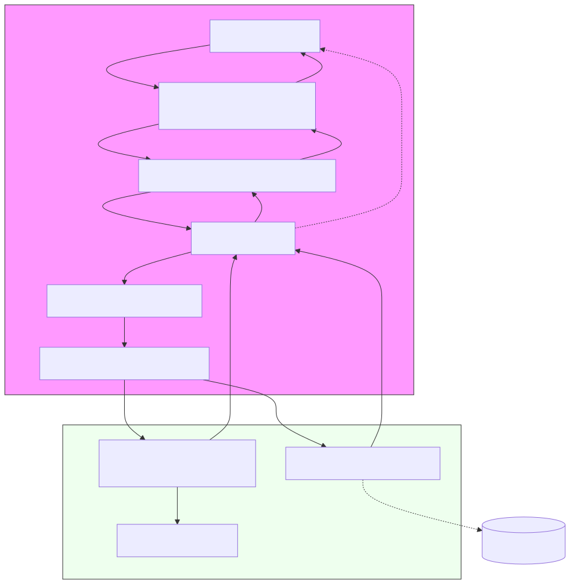

# Architecture overview

## Summary

Dissonance is an Electron desktop application whose audio processing runs in a
C++ engine loaded as a Node native addon. The renderer never touches audio or
the filesystem: everything crosses a `contextBridge` preload into the main
process, which owns the addon and all disk I/O. This document describes that
boundary and the channels across it.

Verified against `ui` / `dev` (`a9b099c`) and `core` / `dev` (`13bac85`),
2026-09-04.

## The three processes

```text
┌─────────────────────────────────────────────────────────────┐
│ Renderer  (renderer/)                                       │
│   Views, controllers, services — plain browser JavaScript.  │
│   No Node integration. Talks only to window.dissonance.     │
└───────────────────────────┬─────────────────────────────────┘
                            │  contextBridge
┌───────────────────────────▼─────────────────────────────────┐
│ Preload  (preload.js)                                       │
│   Exposes window.dissonance — a fixed list of methods,      │
│   each forwarding to one IPC channel.                       │
└───────────────────────────┬─────────────────────────────────┘
                            │  ipcRenderer.invoke / .on
┌───────────────────────────▼─────────────────────────────────┐
│ Main  (main.js → main/MainApplication.js)                   │
│   MainWindowManager  — window creation                      │
│   ipcHandlers/core/  — addon loading, core:* handlers       │
│   ipcHandlers/       — file dialog, theme, log forwarding   │
└───────────────────────────┬─────────────────────────────────┘
                            │  require('…dissonance_core.node')
┌───────────────────────────▼─────────────────────────────────┐
│ Native addon  (core, built via node-gyp / N-API)            │
│   process() · readMetadata() · writeTags()                  │
└─────────────────────────────────────────────────────────────┘
```

`contextIsolation` is on and `nodeIntegration` is off, so the renderer cannot
`require` anything. The preload's method list is the entire attack surface.

## IPC channels

Request/response, via `ipcRenderer.invoke` → `ipcMain.handle`:

| Channel | Preload method | Purpose |
| --- | --- | --- |
| `core:readMetadata` | `readFileMetadata(filePath)` | WAV header and LIST/INFO tags, without decoding audio |
| `core:process` | `processFile(filePath, options)` | Run the protection pipeline; resolves with the processed path |
| `core:writeTags` | `writeTags(filePath, tags)` | Rewrite the LIST/INFO chunk in place |
| `core:export` | `exportFile(processedPath)` | Copy a processed file to a user-chosen destination |
| `core:cleanupProcessed` | `cleanupProcessedFile(path)` | Delete one temporary processed file |
| `dialog:openFile` | `openFile()` | Native open dialog; returns the selected path |
| `ui:getSystemTheme` | `getSystemTheme()` | Current OS colour scheme |

Main → renderer events, via `webContents.send` → `ipcRenderer.on`:

| Event | Preload subscription |
| --- | --- |
| `core:status` | `onCoreStatus(cb)` |
| `ui:systemTheme` | `onSystemTheme(cb)` |
| `app:flushRequest` | `onAppFlushRequest(cb)` |

Renderer → main, fire and forget: `ui:log` (`logToMain`) and `app:flushDone`
(`notifyFlushDone`).

Every subscription helper returns an unsubscribe function; the renderer's
`Disposable` base class tracks them so views clean up on unmount.

## Where the code lives

### `ui`

| Path | Role |
| --- | --- |
| `main.js` | Entry point — constructs `MainApplication` and nothing else |
| `main/MainApplication.js` | Application lifecycle, handler registration, quit/flush |
| `main/MainWindowManager.js` | `BrowserWindow` creation and window state |
| `preload.js` | The `window.dissonance` bridge |
| `ipcHandlers/core/coreSetup.js` | Loads the addon once at module load; wires the handlers |
| `ipcHandlers/core/CoreAddonLoader.js` | Finds and loads the platform `.node` binary |
| `ipcHandlers/core/CoreIpcHandlers.js` | The `core:*` handlers |
| `ipcHandlers/core/TempFileManager.js` | Temporary processed files, cleaned up on quit |
| `ipcHandlers/FileDialogHandlers.js` | `dialog:openFile` |
| `ipcHandlers/themeHandlers.js` | `ui:getSystemTheme`, `ui:systemTheme` |
| `renderer/` | Views, controllers, services — see `ui/renderer/ARCHITECTURE.md` |

### `core`

| Path | Role |
| --- | --- |
| `src/addon/addon.cpp` | N-API entry point — three async workers |
| `src/audio/Pipeline.cpp` | Stage chain: gain → windowed FFT → perturbation → masking |
| `src/utils/WavParser.cpp` | RIFF/WAVE parsing and sample decoding |
| `binding.gyp` | Addon build; `CMakeLists.txt` builds the CLI and tests |

## Data flow — processing a file

1. The user drops a file on the renderer's drop zone.
2. The renderer calls `window.dissonance.readFileMetadata(path)` to fill the
   metadata panel. This is header-only in the addon — no audio is decoded.
3. On Process, the renderer calls `window.dissonance.processFile(path, options)`.
4. `CoreIpcHandlers` allocates a temporary output path through `TempFileManager`
   and calls `addon.process(inputPath, { outputPath, perturbation, modes })`.
5. The addon runs the pipeline on a worker thread and resolves
   `{ ok, processedPath }`. Status updates reach the renderer on `core:status`.
6. On Export, `core:export` opens a save dialog and copies the temporary file to
   the chosen destination.
7. On quit, `MainApplication` calls `cleanupAllTempFiles()`.

If the addon fails to load, `CoreAddonLoader.load()` returns `null` and the
`core:*` handlers return structured errors. There is no simulation fallback —
the app opens but processing fails. See
[the integration analysis](design/core/2026-09-04-cpp-electron-integration-complexity.md)
for what that means in practice and which platforms currently have no binary.

## Diagram source

The Mermaid source is [`architecture.mmd`](architecture.mmd) and the rendered
output is [`architecture.svg`](architecture.svg). Re-render after editing:

```bash
npx @mermaid-js/mermaid-cli -i architecture.mmd -o architecture.svg
```



## Related

- [`research/benchmarks/2026-05-31-poc-electron-audio-loader.md`](research/benchmarks/2026-05-31-poc-electron-audio-loader.md) — how the addon is discovered and loaded, in detail
- [`design/core/2026-09-04-cpp-wav-parser-audit.md`](design/core/2026-09-04-cpp-wav-parser-audit.md) — the WAV parser behind `readMetadata` and `process`
- [`design/core/2026-09-04-cpp-electron-integration-complexity.md`](design/core/2026-09-04-cpp-electron-integration-complexity.md) — build, packaging and failure modes of the addon boundary
- `ui/renderer/ARCHITECTURE.md` — the renderer's internal structure
