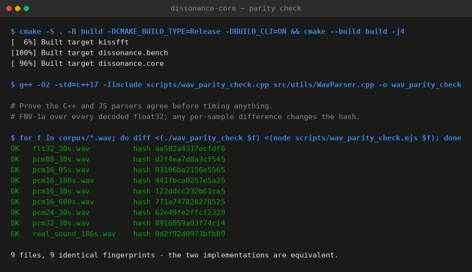
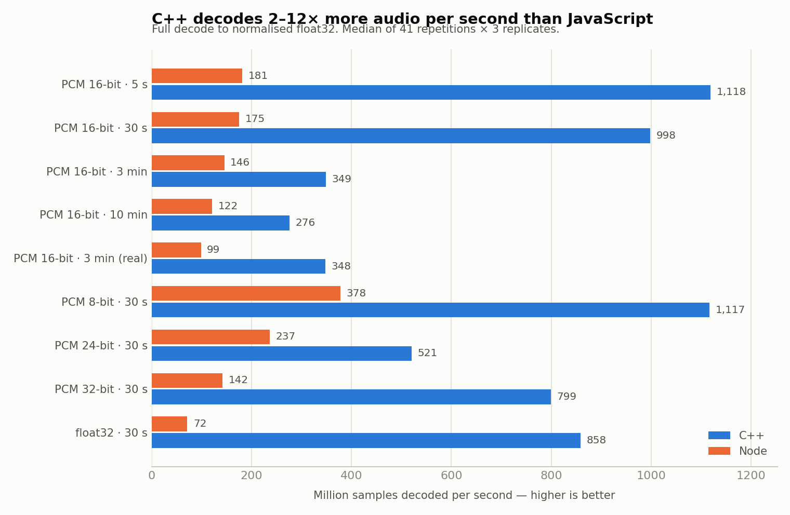
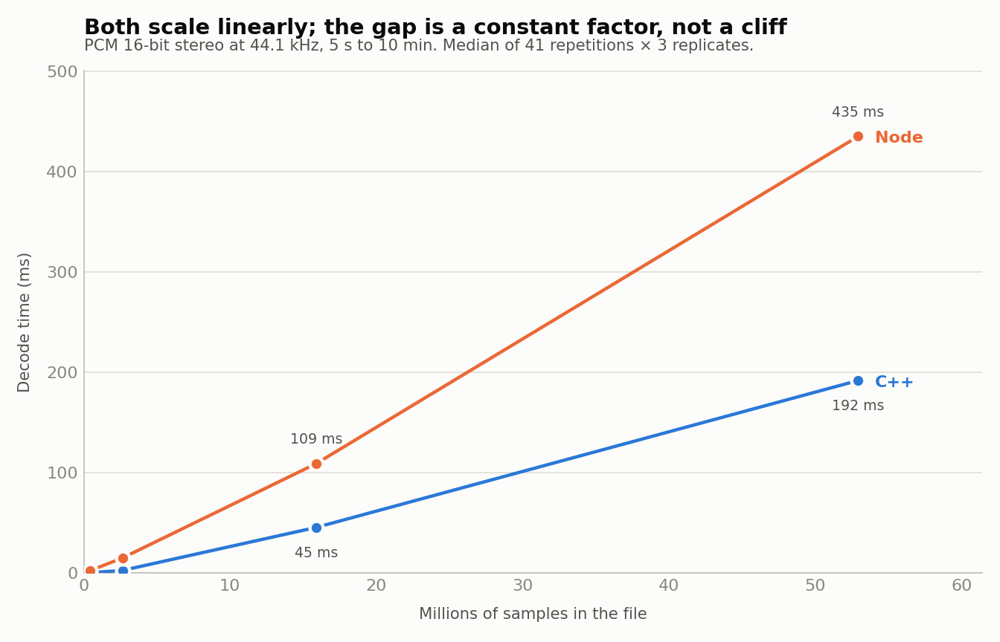
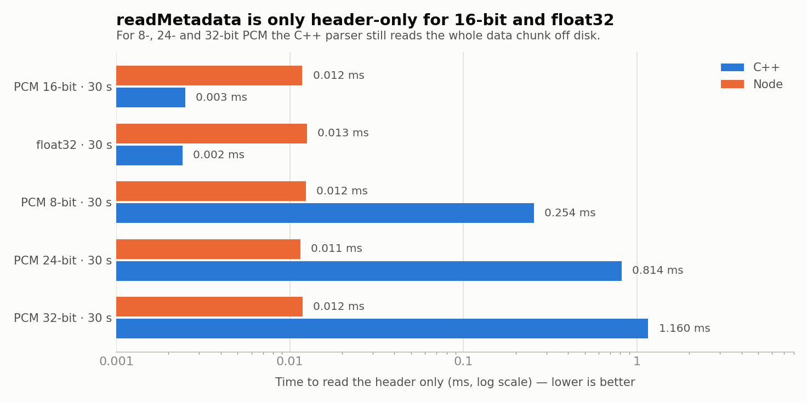
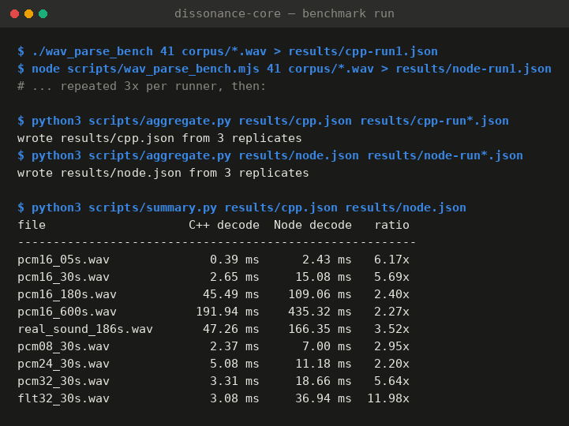

# Benchmark — C++ vs Node WAV parsing

## Summary

C++ decodes WAV audio faster than an equivalent JavaScript implementation, but
the gap narrows sharply as files get larger — from 6–8× on a five-second clip to
**2.3–2.5× on a ten-minute one** — because both implementations become
memory-bandwidth bound. On realistically-sized music files the advantage settles
at 2.5–2.8×, and that band held on both architectures tested. In absolute terms
the largest file measured took 192 ms in C++ against 435 ms in JavaScript.

**Parsing speed alone does not justify the native addon.** A 243 ms difference,
once per file, on an operation the user already expects to take a moment, is not
what makes the C++ core worth its build and packaging cost. The case for C++ has
to be made on the DSP pipeline that runs after parsing — FFT, masking,
perturbation — not on getting samples off disk. What this benchmark does settle
is that a JavaScript fallback path is viable: if the addon fails to load, a pure-JS
parser is a usable degraded mode, not an unusable one.

One finding came out of the run and belongs in the tracker regardless of the
migration decision: the C++ `readMetadata` path reads the entire data chunk for
8-, 24- and 32-bit PCM, making it 400× slower than it needs to be and, in that
case, slower than JavaScript.

## Question

Milestone E asks whether to keep the C++ core, or migrate the audio path to
TypeScript, WebAssembly or Python (E2, E4). This benchmark answers the narrow
part of that: **how much of the C++ core's value is in WAV parsing?** It measures
parsing only. It does not measure the FFT, masking or perturbation stages, which
is where the remaining answer lives.

## What was measured

Two operations, matching the two things the addon actually exposes to the
Electron app:

| Operation | What it does | Addon entry point |
| --- | --- | --- |
| **header** | Read the RIFF/`fmt ` header and any tag chunks; do not touch samples | `readMetadata()` — called on every file the user drops |
| **decode** | Full parse plus every sample converted to normalised `float32` | inside `process()` — called when the user clicks Process |

## Equivalence check

Before timing anything, the two implementations were proven to produce identical
output. `wav_parity_check.cpp` and `wav_parity_check.mjs` print the parsed header
fields, the sample count, the number of preserved chunks, and an FNV-1a hash over
the raw bits of every decoded `float32`. Any single-sample difference — a
rounding divisor, a sign extension, a clamp — changes the hash.

All nine corpus files produced identical fingerprints:



The JavaScript parser in [`scripts/wav_parser.mjs`](scripts/wav_parser.mjs) is a
deliberate port of `core/src/utils/WavParser.cpp`: same chunk walk, same padding
rule, same `fmt`-before-`data` requirement, same stop-at-`data` behaviour, same
per-format divisors. It is not a general-purpose library and does not try to be —
comparing against `node-wav` or `wavefile` would have measured those libraries'
feature sets, not the language.

## Method

- **Corpus** — nine files, generated deterministically by
  [`scripts/make_corpus.py`](scripts/make_corpus.py) plus one real recording.
  A size sweep at 16-bit stereo 44.1 kHz (5 s, 30 s, 3 min, 10 min) isolates
  scaling; a format sweep at 30 s (8-, 24-, 32-bit PCM and 32-bit float)
  isolates per-format decode cost. `real_sound_186s.wav` is `test_files/sound.wav`
  from the core repo — 16-bit stereo, 3:06, with a LIST chunk, the same file the
  addon smoke tests use.
- **Repetitions** — 41 in-process repetitions per file per operation, repeated as
  3 independent process launches. The published figure is the median of the three
  replicate medians; `min` is the fastest single repetition seen.
- **Warm-up** — one full decode per file is run and discarded before timing, to
  warm the page cache and let V8 tier the JavaScript up out of the interpreter.
  Both runners do this. Cold-cache behaviour is not measured.
- **Environments** — the full protocol was run twice, on two architectures:

  | | **x86-64** (primary) | **arm64** (confirmation) |
  | --- | --- | --- |
  | CPU | Intel Xeon @ 2.80 GHz, 2 vCPU | Apple Silicon, 4 vCPU |
  | RAM | 7 GB | 3 GB |
  | OS | Ubuntu 24.04, Linux 6.18 | Ubuntu 22.04, Linux 6.8 |
  | Compiler | GCC 13.3.0, `-O2 -std=c++17` | GCC 11.4.0, `-O2 -std=c++17` |
  | Node | v22.22.2 | v22.23.2 |
  | Results | [`results/`](results/) | [`results/arm64/`](results/arm64/) |

  Both measured 2026-09-04. Tables and figures below are the x86-64 run; the
  arm64 run is compared in [Cross-architecture check](#cross-architecture-check).

Neither machine is a quiet dedicated benchmark host, so absolute times carry
noise. The run-to-run spread table below is the honest error bar; a difference
smaller than it is not a difference. The ratios held across replicates and
across both architectures, and that is what the decision rests on. Re-run the
scripts on a target machine before quoting absolute latencies to anyone.

## Results



### Full decode — the `process` path

| File | C++ median | C++ min | Node median | Node min | Node / C++ |
| --- | ---: | ---: | ---: | ---: | ---: |
| `pcm16_05s.wav` | 0.394 ms | 0.364 | 2.433 ms | 2.302 | 6.17× |
| `pcm16_30s.wav` | 2.651 ms | 2.414 | 15.082 ms | 14.431 | 5.69× |
| `pcm16_180s.wav` | 45.493 ms | 44.094 | 109.064 ms | 86.596 | 2.40× |
| `pcm16_600s.wav` | 191.943 ms | 187.411 | 435.316 ms | 352.453 | 2.27× |
| `real_sound_186s.wav` | 47.256 ms | 44.969 | 166.355 ms | 146.188 | 3.52× |
| `pcm08_30s.wav` | 2.370 ms | 2.279 | 6.999 ms | 6.378 | 2.95× |
| `pcm24_30s.wav` | 5.082 ms | 4.585 | 11.175 ms | 10.683 | 2.20× |
| `pcm32_30s.wav` | 3.310 ms | 2.736 | 18.657 ms | 18.112 | 5.64× |
| `flt32_30s.wav` | 3.083 ms | 2.761 | 36.940 ms | 35.620 | 11.98× |

### Header only — the `readMetadata` path

| File | C++ median | Node median | Node / C++ |
| --- | ---: | ---: | ---: |
| `pcm16_05s.wav` | 0.002 ms | 0.012 ms | 5.15× |
| `pcm16_30s.wav` | 0.003 ms | 0.012 ms | 4.72× |
| `pcm16_180s.wav` | 0.003 ms | 0.013 ms | 5.06× |
| `pcm16_600s.wav` | 0.003 ms | 0.012 ms | 4.94× |
| `flt32_30s.wav` | 0.002 ms | 0.013 ms | 5.23× |
| `pcm08_30s.wav` | **0.254 ms** | 0.012 ms | 0.05× |
| `pcm24_30s.wav` | **0.814 ms** | 0.011 ms | 0.01× |
| `pcm32_30s.wav` | **1.160 ms** | 0.012 ms | 0.01× |

### Run-to-run spread

Gap between the slowest and fastest replicate median, over three replicates.

| File | C++ | Node |
| --- | ---: | ---: |
| `pcm16_05s.wav` | 0.5% | 7.1% |
| `pcm16_30s.wav` | 6.6% | 9.4% |
| `pcm16_180s.wav` | 2.1% | 1.7% |
| `pcm16_600s.wav` | 2.2% | 1.9% |
| `real_sound_186s.wav` | 4.2% | 5.9% |
| `pcm08_30s.wav` | 1.0% | 10.4% |
| `pcm24_30s.wav` | 6.1% | 2.3% |
| `pcm32_30s.wav` | 26.7% | 2.1% |
| `flt32_30s.wav` | 12.5% | 5.3% |

Whole-run peak RSS: C++ 337 MB, Node 389 MB — both dominated by the 212 MB
sample buffer for the ten-minute file, so this is a wash.

## Analysis

**The ratio falls as files grow.** 6.2× at five seconds, 2.3× at ten minutes.
Small files are dominated by fixed costs where C++ has the advantage — a syscall
and a stack object versus V8 allocating a `Buffer` and a `Float32Array` on the
heap. Once the working set no longer fits in cache, both implementations spend
their time waiting on memory, and the language stops mattering much.



Both are linear in sample count, which is the reassuring part. There is no size
at which JavaScript falls off a cliff — a ten-minute file is 435 ms in Node, not
four seconds.

**The float32 outlier, 11.98× here, is architecture-specific.** For IEEE float
input, C++ reads the data chunk directly into the output `vector<float>` and
clamps in place — a single pass over memory with no format conversion. The
JavaScript version cannot: `readFloatLE` goes through a bounds-checked accessor
per sample. A JavaScript implementation that special-cased this by wrapping the
buffer in a `Float32Array` view would close most of the gap, at the cost of
assuming host byte order. It was not done here because the C++ code does not do
it either, and the point was to compare equivalent code. On arm64 the same
comparison gives 4.12×, so this figure is a property of the machine as much as
of the code — see [Cross-architecture check](#cross-architecture-check).

**The 8-bit case is the closest, at 2.95×**, because the JavaScript path is a
plain indexed byte read with no `DataView` call — the fastest thing V8 can do
with a `Buffer`.

**The header-only numbers invert, and that is a bug, not a JavaScript win.**
JavaScript reads the header in a flat ~0.012 ms regardless of file size or
format. C++ matches that for 16-bit and float32, at 0.002–0.003 ms, and then
takes 0.254, 0.814 and 1.160 ms for 8-, 24- and 32-bit.



The cause is in `WavParser.cpp:107–142`: the 16-bit and float32 branches check
`readAudioData` before reading and `seekg` past the data chunk when it is false.
The 8-, 24- and 32-bit branches read the whole chunk into a buffer first and only
then check the flag before converting. The read is the expensive part, and it
scales with file size. This is the UI's hot path — `readMetadata` runs on every
dropped file to populate the metadata form. See limitation 1 in the
[parser audit](../../../design/core/2026-09-04-cpp-wav-parser-audit.md).

## Cross-architecture check

The whole protocol — corpus generation, parity check, three replicates each —
was re-run on arm64. All nine files passed the parity check there too. Absolute
times are 1.7–2.3× faster across the board, which is the hardware; what matters
is whether the *conclusions* hold.

| File | Node / C++ (x86-64) | Node / C++ (arm64) |
| --- | ---: | ---: |
| `pcm16_05s.wav` | 6.17× | 7.84× |
| `pcm16_30s.wav` | 5.69× | 6.69× |
| `pcm16_180s.wav` | 2.40× | 2.82× |
| `pcm16_600s.wav` | 2.27× | 2.45× |
| `real_sound_186s.wav` | 3.52× | 2.80× |
| `pcm08_30s.wav` | 2.95× | 3.38× |
| `pcm24_30s.wav` | 2.20× | 2.58× |
| `pcm32_30s.wav` | 5.64× | 5.38× |
| `flt32_30s.wav` | 11.98× | 4.12× |

Three things hold on both:

- **The shape.** The ratio is highest on small files and falls as they grow —
  7.8× at five seconds down to 2.5× at ten minutes on arm64, the same curve as
  x86-64. Both implementations converge as they become memory-bound.
- **The floor.** On realistically-sized files the advantage is 2.5–2.8× on both,
  which is the number the E4 decision should use.
- **The `readMetadata` bug.** 0.002 ms for 16-bit and float32 against 0.118,
  1.159 and 1.513 ms for 8-, 24- and 32-bit. It is algorithmic, not
  architectural, and it is worse on arm64 for 32-bit than on x86-64.

One thing does not hold: **the float32 outlier is architecture-specific.**
11.98× on x86-64, 4.12× on arm64 — because the C++ side got slower there
(765 vs 858 Msample/s) while the JavaScript side got much faster (186 vs 72
Msample/s). Do not quote the 12× figure as a general result; the 2.5–2.8×
band on realistic files is the one that travels.

Node's peak RSS was 431 MB on arm64 against 389 MB on x86-64, versus 336–337 MB
for C++ on both. The JavaScript heap overhead is real but does not change any
conclusion.

## Threats to validity

- **Shared cloud runner.** Two vCPUs with noisy neighbours. The 26.7% spread on
  one C++ figure is the runner, not the code. Ratios held across replicates;
  absolute numbers should be re-measured on a target machine.
- **Warm cache only.** Every measurement follows a warm-up pass. Real first-open
  latency includes reading 100 MB off disk, which dwarfs both parsers and affects
  them equally.
- **Node 22 outside Electron.** The app runs Electron 40, which embeds a
  different V8 build, and the main process is doing other work. Expect the
  JavaScript side to be somewhat slower in situ.
- **Linux only.** Both runs are Linux — x86-64 and arm64. Neither is macOS or
  Windows, where a different libc, allocator and filesystem could move the
  numbers. The arm64 run does at least cover Apple Silicon hardware, which is
  what the team develops on.
- **Parsing only.** The FFT, masking and perturbation stages are not measured
  here. They are where the C++ core is most likely to earn its cost, and E4
  should not be decided until they are.

## Conclusion

For the migration decision (E4):

1. **Parsing is not the argument for C++.** A 2.2–3.5× advantage on
   realistically-sized files, worth tens to a few hundred milliseconds once per
   file, does not pay for a native addon, a three-platform build matrix and a
   binary-sync pipeline on its own.
2. **A JavaScript fallback is viable.** Whatever E4 decides about the core, the
   Electron app can carry a pure-JS parser for the case where the addon fails to
   load, and users would see a slower app rather than a broken one. Today, a
   missing addon means `process` returns a structured error and nothing works.
3. **Benchmark the DSP before deciding.** E2 as scoped in `milestones.md` asks
   for "C++ vs Node vs WASM parsing". Parsing turns out to be the part where the
   answer matters least. The FFT and masking stages should be measured the same
   way — same corpus, same equivalence check — before E4 is written.

The conclusion would flip if a target file size showed JavaScript taking longer
than roughly a second to parse. On this hardware that would need a file around
25 minutes long; the UI's own use case tops out well below that.

## Reproducing

From a clean checkout of `core` at `dev`:

```bash
# 1. Corpus (writes ~175 MB)
python3 scripts/make_corpus.py corpus
cp test_files/sound.wav corpus/real_sound_186s.wav

# 2. Harnesses
g++ -O2 -std=c++17 -Iinclude scripts/wav_parse_bench.cpp \
    src/utils/WavParser.cpp -o wav_parse_bench
g++ -O2 -std=c++17 -Iinclude scripts/wav_parity_check.cpp \
    src/utils/WavParser.cpp -o wav_parity_check

# 3. Prove the implementations agree — do not skip this
for f in corpus/*.wav; do
  diff <(./wav_parity_check "$f") <(node scripts/wav_parity_check.mjs "$f") \
    && echo "OK $f"
done

# 4. Measure, three replicates each
for i in 1 2 3; do
  ./wav_parse_bench 41 corpus/*.wav > results/cpp-run$i.json
  node scripts/wav_parse_bench.mjs 41 corpus/*.wav > results/node-run$i.json
done

# 5. Aggregate, tabulate, plot
python3 scripts/aggregate.py results/cpp.json  results/cpp-run*.json
python3 scripts/aggregate.py results/node.json results/node-run*.json
python3 scripts/compare.py results/cpp.json results/node.json > results/results.md
python3 scripts/plot.py    results/cpp.json results/node.json figures
```



Raw per-replicate output is committed under [`results/`](results/) so the
aggregation can be checked without re-running anything.

## Files

| Path | What it is |
| --- | --- |
| [`scripts/make_corpus.py`](scripts/make_corpus.py) | Generates the eight synthetic corpus files |
| [`scripts/wav_parser.mjs`](scripts/wav_parser.mjs) | JavaScript port of core's `Parser` |
| [`scripts/wav_parse_bench.cpp`](scripts/wav_parse_bench.cpp) | C++ timing harness |
| [`scripts/wav_parse_bench.mjs`](scripts/wav_parse_bench.mjs) | JavaScript timing harness |
| [`scripts/wav_parity_check.cpp`](scripts/wav_parity_check.cpp) | C++ fingerprint |
| [`scripts/wav_parity_check.mjs`](scripts/wav_parity_check.mjs) | JavaScript fingerprint |
| [`scripts/aggregate.py`](scripts/aggregate.py) | Median-of-medians across replicates |
| [`scripts/compare.py`](scripts/compare.py) | Generates the tables above |
| [`scripts/summary.py`](scripts/summary.py) | Console summary table |
| [`scripts/plot.py`](scripts/plot.py) | Generates the figures |
| [`scripts/make_edge_cases.py`](scripts/make_edge_cases.py) | Malformed files for the parser audit (E1) |
| [`scripts/probe_parser.cpp`](scripts/probe_parser.cpp) | Reports the parser's behaviour on those (E1) |
| [`results/`](results/) | Per-replicate JSON, aggregates, generated tables (x86-64) |
| [`results/arm64/`](results/arm64/) | The same, from the arm64 run |
| [`figures/`](figures/) | Charts and run transcripts |

## Related

- [`../../../design/core/2026-09-04-cpp-wav-parser-audit.md`](../../../design/core/2026-09-04-cpp-wav-parser-audit.md) — E1, what the C++ parser does and where it is wrong
- [`../../../design/core/2026-09-04-cpp-electron-integration-complexity.md`](../../../design/core/2026-09-04-cpp-electron-integration-complexity.md) — E3, what shipping it costs
- [`../2026-05-31-poc-electron-audio-loader.md`](../2026-05-31-poc-electron-audio-loader.md) — how the Electron app loads the addon
- [`../2025-11-21-electron-comparative-study.md`](../2025-11-21-electron-comparative-study.md) — the earlier JUCE vs Electron comparison
- [`../../../planning/milestones.md`](../../../planning/milestones.md) — Milestone E task list
